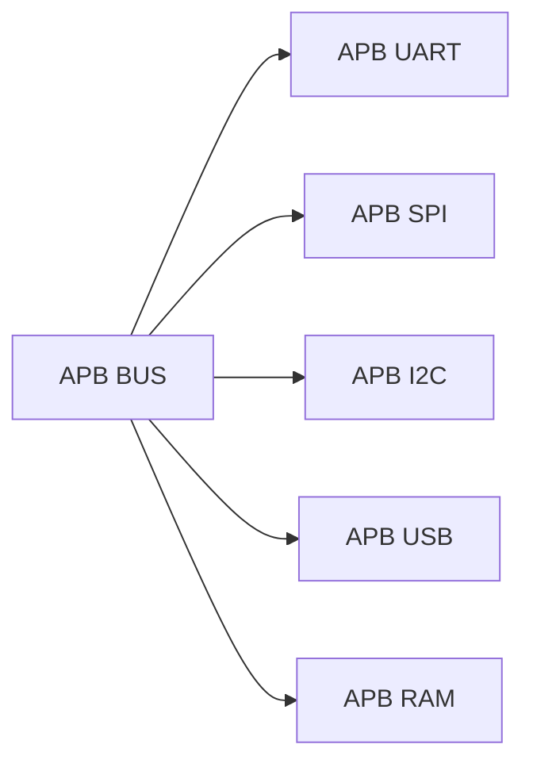
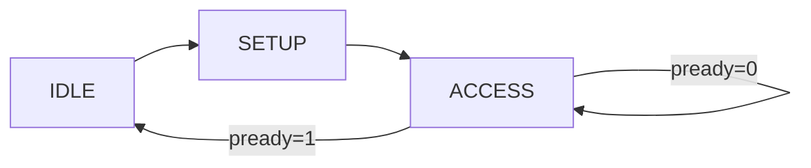

<h1 align="center"> APB Peripheral Wrappers - Verilog RTL Design </h1>

<p align="center">


</p>

<p align="center">


</p>

---

<p align="center">
This module set implements <b>APB Wrappers</b> for UART, SPI, I2C, USB, and RAM, converting APB transactions into peripheral-specific control signals.
</p>

---

# System Architecture



- Each wrapper connects one peripheral to APB  
- APB bus selects wrapper using address decoding  
- Only one wrapper active per transfer  

---

# APB Wrapper Operation


- SETUP: Address + control valid  
- ACCESS: Data transfer  
- Peripheral reacts based on register mapping  

---

# Common Interface

All wrappers use:

```verilog
psel & penable & pwrite → WRITE
psel & penable & !pwrite → READ
```

- No wait states (pready = 1) except RAM  
- No error (pslverr = 0) except RAM  

---

# APB UART Wrapper

## Function

- Transmit (TX) and Receive (RX) data  
- Controls UART core via register interface  

## Address Map

| Addr | Function |
|------|---------|
| 0x0 | TX Data (write triggers send) |
| 0x4 | RX Data |
| 0x8 | Status (rx_done, tx_busy) |

## Operation

- Write → loads tx_data and asserts tx_start (pulse)  
- Read → returns RX data or status  

## Key Behavior

- `tx_start` is single-cycle pulse  
- Continuous RX monitoring from UART  

---

# APB SPI Wrapper

## Function

- SPI Master control  
- Configurable mode (CPOL, CPHA)  

## Address Map

| Addr | Function |
|------|---------|
| 0x0 | TX Data |
| 0x4 | RX Data |
| 0x8 | Control (cpol, cpha, start) |
| 0xC | Status (done) |

## Operation

- Write TX data  
- Configure SPI mode  
- Trigger transfer using start  

## Key Behavior

- `start` is pulse signal  
- `done` indicates transfer completion  

---

# APB I2C Wrapper

## Function

- I2C Master interface  
- Supports read/write transactions  

## Address Map

| Addr | Function |
|------|---------|
| 0x0 | Control (enable, rw) |
| 0x4 | Slave Address |
| 0x8 | TX Data |
| 0xC | RX Data |

## Operation

- Write control → starts transaction  
- RW selects read/write  
- Data transferred via tx_data / rx_data  

## Key Behavior

- `enable` acts as start pulse  
- Address + data configured before transaction  

---

# APB USB Wrapper

## Function

- Basic USB control interface  
- Enables/disables USB core  

## Address Map

| Addr | Function |
|------|---------|
| 0x0 | Enable |
| 0x4 | Status (dummy) |
| 0x8 | Data (placeholder) |

## Operation

- Write → enables USB core  
- Read → returns control/status  

## Key Behavior

- Minimal wrapper  
- USB logic handled internally  

---

# APB RAM Wrapper

## Function

- Memory-mapped storage  
- Supports read/write with wait states and error  

---

## Architecture


- FSM controls APB phases  
- Memory stores data  

---

## Addressing

```verilog
addr = paddr[ADDR_WIDTH+1:2]
```

- Word-aligned addressing  
- Prevents byte misalignment  

---

## FSM Behavior



- IDLE → wait for request  
- SETUP → prepare  
- ACCESS → perform read/write  

---

## Wait State Handling

- Controlled using `WAIT_CYCLES`  
- pready asserted after delay  
- simulates slow memory  

---

## Error Handling

- Address out of range → PSLVERR = 1  
- Returns `0xDEADBEEF`  

---

## Operation

- Write → mem[addr] = pwdata  
- Read → prdata = mem[addr]  

---

# Key Design Patterns

## Pulse-Based Control

- UART: tx_start  
- SPI: start  
- I2C: enable  

→ Trigger operations using single-cycle pulse  


## Register-Based Interface

- Each peripheral controlled via mapped registers  
- Simple and scalable  


## Unified APB Interface

- Same handshake for all wrappers  
- Easy integration into APB bus  

---

# Role in SoC

- Connects peripherals to APB  
- Enables structured memory-mapped design  
- Simplifies SoC integration  

---

<p align="center"><b>
APB wrappers act as the interface layer between the APB bus and peripheral cores, enabling clean, modular, and scalable SoC design.

---
