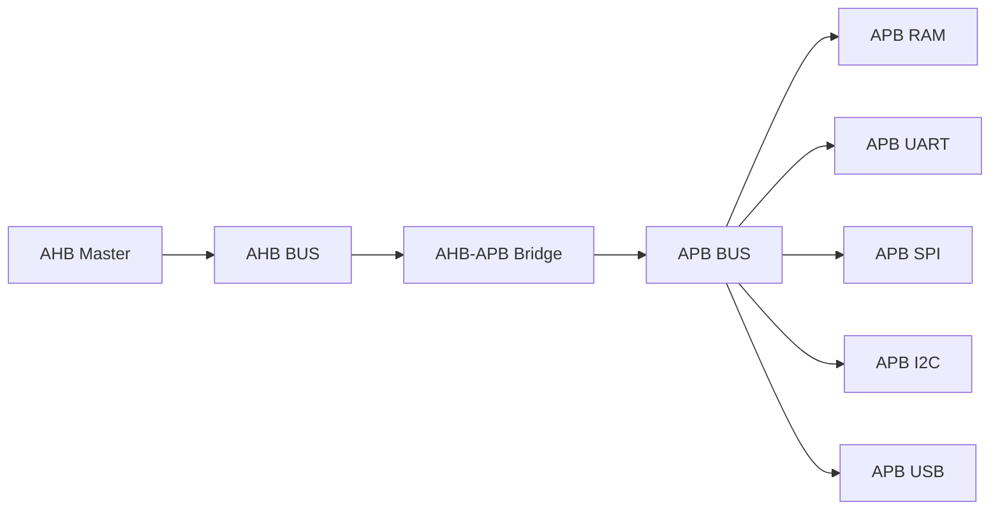
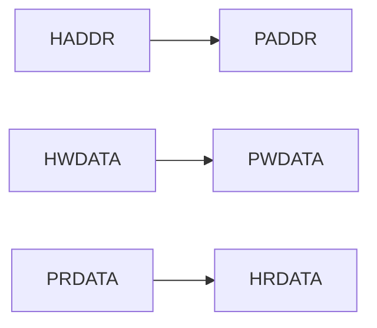
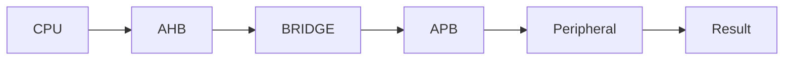
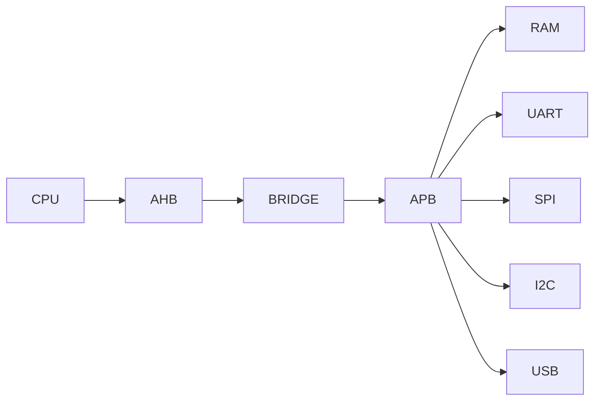

<h1 align="center"> APB Wrappers & SoC Top Integration - Verilog RTL Design </h1>

---

This section integrates APB peripheral wrappers with AHB, APB, and Bridge modules to form a complete SoC using a hierarchical AMBA-based architecture.

---

# SoC Architecture

- AHB handles high-speed transactions  
- APB connects low-speed peripherals  
- Bridge performs protocol conversion (pipeline → non-pipeline)  

---

# RTL Integration Flow

- `ahb_master` generates transactions  
- `ahb_bus` forwards signals to bridge  
- `ahb_apb_bridge` converts protocol  
- `apb_bus` performs address decoding  
- Wrappers interface peripherals  

---

# Signal-Level Data Flow

- Address and control flow: AHB → APB  
- Write data: HWDATA → PWDATA  
- Read data: PRDATA → HRDATA  

---

# Address Mapping (APB Bus)

| Address | Peripheral |
|--------|-----------|
| 0x0000_0000 | RAM |
| 0x0000_1000 | UART |
| 0x0000_2000 | SPI |
| 0x0000_3000 | I2C |
| 0x0000_4000 | USB |

- Decoded using `paddr[15:12]`  
- Generates `psel_*` signals  
- Only one peripheral active at a time  

---

# APB Wrapper Operation

- SETUP: `psel=1`, `penable=0`  
- ACCESS: `penable=1`  
- Transfer completes when `pready=1`  

---

# Peripheral Behavior

## UART
- TX triggered via `tx_start` pulse  
- RX continuously sampled  
- Status: `tx_busy`, `rx_done`  

## SPI
- Start controlled via register bit  
- CPOL/CPHA configurable  
- `done` indicates completion  

## I2C
- `enable` acts as transaction trigger  
- `rw` selects read/write  
- Address + data loaded before execution  

## USB
- Controlled using enable register  
- Minimal wrapper (core handles protocol)  

## RAM
- FSM-based APB slave  
- Supports wait states (`WAIT_CYCLES`)  
- Error on invalid address (`PSLVERR=1`)  

---

# System-Level Operation

- CPU initiates transaction  
- AHB carries address/control  
- Bridge converts to APB  
- Peripheral executes and responds  

---

# Key Design Decisions

## 1. Hierarchical Bus Design
- AHB → high-speed backbone  
- APB → low-power peripheral bus  

## 2. Protocol Isolation
- Bridge isolates timing and protocol differences  

## 3. Modular Wrappers
- Each peripheral independently pluggable  

## 4. Pulse-Based Control
- UART (`tx_start`)  
- SPI (`start`)  
- I2C (`enable`)  

---

# Modules Integrated

- ahb_master  
- ahb_bus  
- ahb_apb_bridge  
- apb_bus  
- apb_uart  
- apb_spi  
- apb_i2c  
- apb_usb  
- apb_ram  

---

# Key Features

- Full AMBA-based SoC implementation  
- Clean separation of bus domains  
- Scalable peripheral architecture  
- Memory-mapped access  
- Supports wait states and error handling  

---

# Final Outcome

A complete SoC integrating multiple peripherals using structured bus hierarchy and protocol conversion.

---

<b>
This design demonstrates end-to-end SoC development, from bus protocols and bridge design to peripheral integration, forming a scalable and modular architecture suitable for real-world VLSI systems.

---
